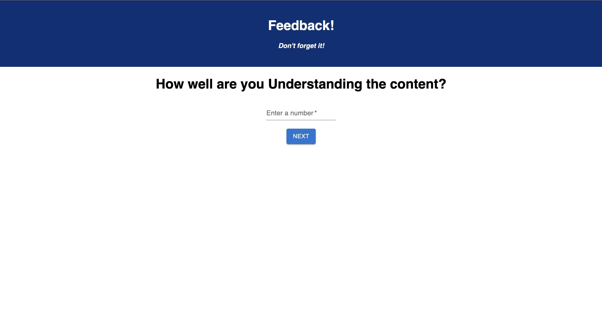
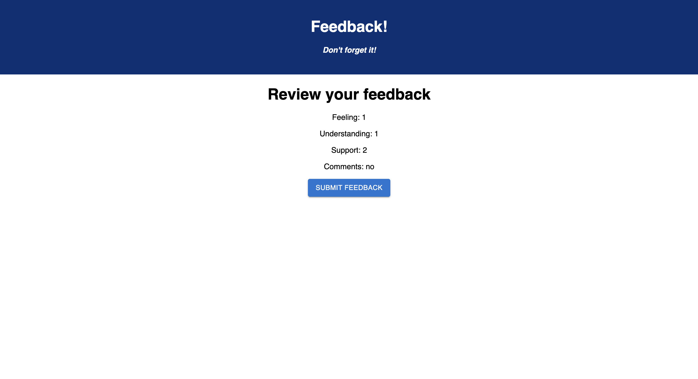

# Feedback Form

## Description

_Duration: 2 day Sprint_

This application contains 3 questions that ask about how your day of class went, and asks the user to give a score of 1-5. Each page has a different question, such as How are you feeling today? How well did you understand the content? How well did you feel supported?

To see the fully functional site, please visit: [DEPLOYED VERSION OF APP](https://weekend-challenge-form.herokuapp.com/#/)

## Screen Shot

#

### Prerequisites

- [Node.js](https://nodejs.org/en/)
- [Postgres](https://www.postgresql.org/download/)

## Installation

1. Create a database named `prime_feedback`,
2. The queries in the `data.sql` file are set up to create all the necessary tables and populate the needed data to allow the application to run correctly. The project is built on [Postgres](https://www.postgresql.org/download/), so you will need to make sure to have that installed. We recommend using Postico to run those queries as that was used to create the queries, 
3. Open up your editor of choice and run an `npm install`
4. Run `npm run server` in your terminal
5. Run `npm run client` in your terminal
6. The `npm run client` command will open up a new browser tab for you!

## Usage

1. Give a score of 1-5 for each of the questions shown on screen
2. Press 'Next' when you finish a question 
3. At the end of the form you can leave a comment
4. submit your answers on the review page

## Built With
- Javascript
- React.js
- Redux
- Material UI

## Acknowledgement
Thanks to [Prime Digital Academy](www.primeacademy.io) who equipped and helped me to make this application a reality. (Thank your people)

## Support
If you have suggestions or issues, please email me at smrdelb@gmail.com